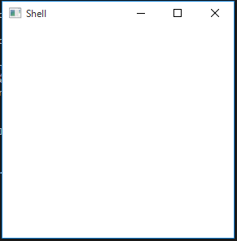

# Bootstrapを使おう

Prismでは、アプリケーションの起動シーケンスを司るBootstrapクラスが用意されています。ここでは、これを使って画面を表示するだけのHello worldアプリケーションを作成してみます。

## ライブラリの導入

HelloWorldAppという名前でプロジェクトを作ったらNuGetから以下の2つのライブラリを追加します。

- Prism.Core
- Prism.Unity

前者はPrismの基本的なコア機能になります。後者は、Prismで使用するDIコンテナとしてUnityをここでは使っていこうと思っているので、それのためのライブラリになります。

## 基本となるWindowの作成

Prismでは、基本となるWindowが1つ必要になります。一般的にはShellという名前が用いられているみたいです。なので、Shellという名前でWindowを作成します。MainWindow.xamlを削除して新規にViews名前空間にWindowをShellという名前で作成します。

次に、プロジェクト直下にBootstrapperという名前のクラスを作成します。


```cs
using HelloWorldApp.Views;
using Microsoft.Practices.Unity;
using Prism.Unity;
using System.Windows;

namespace HelloWorldApp
{
    class Bootstrapper : UnityBootstrapper
    {
        protected override DependencyObject CreateShell()
        {
            // this.ContainerでUnityのコンテナが取得できるので
            // そこからShellを作成する
            return this.Container.Resolve<Shell>();
        }

        protected override void InitializeShell()
        {
            // Shellを表示する
            ((Window)this.Shell).Show();
        }
    }
}
```

ここまでで、プロジェクトは以下のような感じになっているはずです。

- HelloWorldApp
	- Views
		- Shell.xaml
	- Bootstrapper.cs


最後に、Bootstrapperを使うようにアプリケーションの起動処理を書き換えます。App.xamlを以下のように書き換えてApplication_Startupイベントハンドラを作成します。

```xml
<Application x:Class="HelloWorldApp.App"
             xmlns="http://schemas.microsoft.com/winfx/2006/xaml/presentation"
             xmlns:x="http://schemas.microsoft.com/winfx/2006/xaml"
             xmlns:local="clr-namespace:HelloWorldApp"
             Startup="Application_Startup">
    <Application.Resources>
         
    </Application.Resources>
</Application>
```

Application_StartupイベントハンドラにBootstrapperの起動処理を書きます。

```cs
using System.Windows;

namespace HelloWorldApp
{
    /// <summary>
    /// App.xaml の相互作用ロジック
    /// </summary>
    public partial class App : Application
    {
        private void Application_Startup(object sender, StartupEventArgs e)
        {
            // Bootstrapperを起動する
            new Bootstrapper().Run();
        }
    }
}
```

この状態でアプリケーションを起動すると以下のようにWindowが表示されます。



以上がPrismを使った最小のアプリケーションになります。