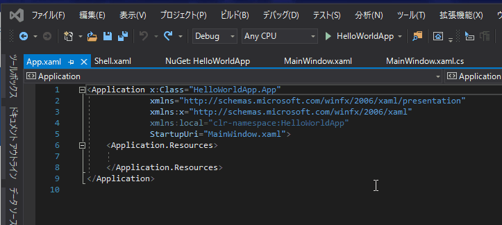

# Prism を使った最小のアプリケーション

Prism では、アプリケーション開発に必要な様々な機能が提供されています。
これらの機能を正しく使えるようにセットアップするために WPF の Application クラスを拡張した PrismApplication というクラスが提供されています。

このクラスを継承して必要なメソッドをオーバーライドするだけで、Prism に必要な各種機能のセットアップが行われます。ここでは、これを使って画面を表示するだけの Hello world アプリケーションを作成してみます。

## ライブラリの導入

HelloWorldApp という名前でプロジェクトを作ったらNuGetから以下の2つのライブラリを追加します。

- Prism.Unity 7.2

このパッケージを追加することで WPF 版の Prism で必要なクラスが全て追加されます。Prism は DI コンテナを使用する前提なので、ここでは Unity という DI コンテナを使うので Prism.Unity パッケージを追加しました。この他に DryIoc を使ったパッケージもあります。

## 基本となる Window の作成

Prism では、基本となる Window が 1 つ必要になります。一般的には Shell という名前が用いられています。なので、Shell という名前で Window を作成します。MainWindow.xaml を削除して新規に Views 名前空間に Window を Shell という名前で作成します。

次に、App.xaml を以下のように編集して Application クラスから PrismApplication に変更します。

Visual Studio 2019 のクイック フィックス機能 (Ctrl + .) を使うと簡単に変更できます。



最終的に App.xaml は以下のようになります。

```xml
<prism:PrismApplication
    x:Class="HelloWorldApp.App"
    xmlns="http://schemas.microsoft.com/winfx/2006/xaml/presentation"
    xmlns:x="http://schemas.microsoft.com/winfx/2006/xaml"
    xmlns:prism="http://prismlibrary.com/" />
```

> XAML のフォーマットには Visual Studio の拡張機能の XAML Styler を使用しています。人力フォーマットは疲れるので、これに身を任せるのも一つの手です。

App.xaml.cs のほうも基本クラスを Application から PrismApplication に変更して基本的なメソッドをオーバーライドします。

```cs
using HelloWorldApp.Views;
using Prism.Ioc;
using Prism.Unity;
using System.Windows;

namespace HelloWorldApp
{
    public partial class App : PrismApplication
    {
        // IContainerProvider が Container で取得できるので、そこから Shell を作成する
        protected override Window CreateShell() => Container.Resolve<Shell>();

        protected override void RegisterTypes(IContainerRegistry containerRegistry)
        {
        }
    }
}
```

ここまでで、プロジェクトは以下のような感じになっているはずです。

- HelloWorldApp
	- Views
		- Shell.xaml
		- Shell.xaml.cs
    - App.xaml
	- App.xaml.cs


この状態でアプリケーションを起動すると以下のようにWindow が表示されます。


以上がPrismを使った最小のアプリケーションになります。