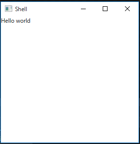

# ViewModelLocatorを使おう

Prismでは、ViewとViewModelを紐づけるための機能としてViewModelLocatorというものを提供しています。この機能を有効にするにはWindowやUserControlなどのViewに以下のXAMLを追加するだけです。

```xml
xmlns:prism="http://prismlibrary.com/"
prism:ViewModelLocator.AutoWireViewModel="True"
```

この宣言をViewのXAMLに追加すると以下のようなルールでViewModelが決定されます。

HogeProject.FooNamespace.Views.SampleWindowというViewがあった場合、HogeProject.FooNamespace.ViewModels.SampleWindowViewModelという名前のViewModelが自動的にDataContextに割り当てられます。（SampleViewのようにViewで名前が終わる場合は、SampleViewModelになります）

Bootstrapperの使いかたで作ったようにViews名前空間にShellクラスを作っているケースについて考えてみます。Shellに対して上記のXAMLを追加するとViewModels名前空間のShellViewModelがDataContextに設定されます。以下のようなViewModelを定義してみました。

```cs
namespace ViewModelLocatorSampleApp.ViewModels
{
    class ShellViewModel
    {
        public string Message { get; } = "Hello world";
    }
}
```

Shellのほうで、MessageプロパティをバインドするようなTextBlockを設置します。

```xml
<Window x:Class="ViewModelLocatorSampleApp.Views.Shell"
        xmlns="http://schemas.microsoft.com/winfx/2006/xaml/presentation"
        xmlns:x="http://schemas.microsoft.com/winfx/2006/xaml"
        xmlns:d="http://schemas.microsoft.com/expression/blend/2008"
        xmlns:mc="http://schemas.openxmlformats.org/markup-compatibility/2006"
        xmlns:local="clr-namespace:ViewModelLocatorSampleApp.Views"
        xmlns:prism="http://prismlibrary.com/"
        prism:ViewModelLocator.AutoWireViewModel="True"
        mc:Ignorable="d"
        Title="Shell" Height="300" Width="300">
    <Grid>
        <TextBlock Text="{Binding Message}" />
    </Grid>
</Window>
```

実行すると以下のようになります。



このとき、ShellViewModelは自動的にUnityコンテナから取得されています。そのため、以下のようにすることで、オブジェクトを外部からインジェクションすることが出来ます。

```cs
namespace ViewModelLocatorSampleApp.Models
{
    class MessageProvider
    {
        public string Message { get; } = "Hello World";
    }
}
```

このクラスをインジェクションするようにViewModelを書き換えます。

```cs
using Microsoft.Practices.Unity;
using ViewModelLocatorSampleApp.Models;

namespace ViewModelLocatorSampleApp.ViewModels
{
    class ShellViewModel
    {
        [Dependency]
        public MessageProvider MessageProvider { get; set; }
    }
}
```

XAMLのBindingもMessageProviderを使うように書き換えます。

```xml
<Window x:Class="ViewModelLocatorSampleApp.Views.Shell"
        xmlns="http://schemas.microsoft.com/winfx/2006/xaml/presentation"
        xmlns:x="http://schemas.microsoft.com/winfx/2006/xaml"
        xmlns:d="http://schemas.microsoft.com/expression/blend/2008"
        xmlns:mc="http://schemas.openxmlformats.org/markup-compatibility/2006"
        xmlns:local="clr-namespace:ViewModelLocatorSampleApp.Views"
        xmlns:prism="http://prismlibrary.com/"
        prism:ViewModelLocator.AutoWireViewModel="True"
        mc:Ignorable="d"
        Title="Shell" Height="300" Width="300">
    <Grid>
        <TextBlock Text="{Binding MessageProvider.Message}" />
    </Grid>
</Window>
```

実行結果は先ほどと変わらないため割愛します。このようにViewとViewModelの紐づけと、ViewModelへの外部クラスの注入などが使えるのがPrismとPrism.Unityを使ったときの便利な点です。