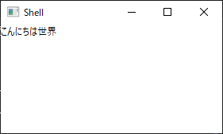

# Module と Region

Prism には、Module と呼ばれる機能があります。これはアプリケーションを複数の機能に分割して開発するための仕組みです。Prism では分割したモジュールを 1 つのアプリケーションにまとめる機能があります。

## Module の使い方

ここでは簡単な Module の使い方を示します。まず Module を作るにはクラスライブラリ プロジェクトを作成します。WPF のクラス群が最初から使えるようにカスタム コントロールかユーザ コントロール用のライブラリを作成するのが手間が少なくていいです。クラス ライブラリを作成したら、初期状態で作成されているクラスを削除して Prism.Wpf を NuGet から追加します。
モジュールでは DI コンテナの API を直接触ることは少ないので、基本的には DI コンテナを含まない WPF 用の Prism のパッケージである Prism.Wpf を参照に追加するだけで大丈夫です。

そして、Prism.Modularity.IModule インターフェースを実装したクラスを作成します。このクラスが Prism のモジュールのエントリポイントになります。

作成した Module は、App クラスのあるプロジェクトにプロジェクト参照を追加して、ConfigureModuleCatalog メソッドをオーバーライドしてIModuleCatalog インターフェースの AddModule メソッドで Prism に Module を追加できます。

```cs
protected override void ConfigureModuleCatalog(IModuleCatalog moduleCatalog)
{
    moduleCatalog.AddModule<ModuleApp.HelloWorld.HelloWorldModule>();
}
```

ここでは、ModuleApp.HelloWorld.HelloWorldModule クラスが IModule を実装したクラスになります。

### IModule インターフェース

IModule インターフェースは、OnInitialized メソッドと RegisterTypes メソッドを持つだけのシンプルなインターフェースです。RegisterTypes メソッドでアプリケーションで使用する型を DI コンテナに登録して OnInitialized でモジュールの初期化処理を行います。

## Region について

Module を作成した具体的なコードの前に Region について触れておきたいと思います。Prism は Module を組み立てることで柔軟にアプリケーションを構築できます。
Module 間は疎結合に作られるのが理想的で、Module 内のクラスは、何かしらのメッセージング機構を使って連携するのが理想的です。（Prism には、メッセージング機構も用意されています）

柔軟に Module を組み合わせてアプリケーションを作るための画面側の仕組みとして Region というものがあります。これは、Shell をいくつかの区画（Region）にわけて、そこに対して画面部品を流し込むことで画面側も複数 Module で構成されたときにも柔軟に対応できるようにしています。

Region を使うには、画面の区画として扱いたいところに RegionName を付けます。

```xml
xmlns:prism="http://prismlibrary.com/"

<ContentControl prism:RegionManager.RegionName="MainRegion" />
```

RegionName をつけることが出来るコントロールは、ContentControl のほかに ItemsControl (を継承したコントロール) などがあります。
ContentControl は、Region 内でアクティブになれる View が 1 度に 1 つなのに対して、ItemsControl は複数の View に対応している点が異なります。

名前をつけた Region に表示する View は DI コンテナに object 型で名前を指定して登録したものを表示できます。
手動で登録しても良いですが、Prism の管理する DI コンテナに型を登録するための IContainerRegistry インターフェースの RegisterForNavigation というメソッドを使うことで、Region に表示する型として登録してくれます。コードで示すと以下のようになります。

```cs
// HelloWorldView という名前で object 型で登録してくれる
containerRegistry.RegisterForNavigation<HelloWorldView>();
```


Region を作成して View を登録したら、Prism の提供する IRegionManager の RequestNavigate を呼び出すことで View を表示できます。


```cs
regionManager.RequestNavigate("MainRegion", nameof(HelloWorldView));
```

## Module と Region を使ったプログラム例

ということで、Module と Region を使った簡単なプログラムを組んでいきたいと思います。ModuleApp という名前で WPF アプリケーションを作成して Prism.Unity を NuGet から追加します。
そして、Shell.xaml を作成してApp クラスの基本クラスを PrismApplication に変更して Shell を表示するところまで作成します。

### Region の作成

Shell.xaml を以下のように編集して MainRegion という名前の ContentControl 型のリージョンを作成します。

```xml
<Window
    x:Class="ModuleApp.Views.Shell"
    xmlns="http://schemas.microsoft.com/winfx/2006/xaml/presentation"
    xmlns:x="http://schemas.microsoft.com/winfx/2006/xaml"
    xmlns:d="http://schemas.microsoft.com/expression/blend/2008"
    xmlns:local="clr-namespace:ModuleApp.Views"
    xmlns:mc="http://schemas.openxmlformats.org/markup-compatibility/2006"
    xmlns:prism="http://prismlibrary.com/"
    Title="Shell"
    Width="800"
    Height="450"
    mc:Ignorable="d">
    <Grid>
        <ContentControl prism:RegionManager.RegionName="MainRegion" />
    </Grid>
</Window>
```

### Module の作成

ModuleApp.HelloWorld という名前で WPF カスタムコントロール ライブラリを作成して、カスタムコントロールのコードを削除します。そこにPrism.Wpf を NuGet から追加します。
ここに各種クラスを作っていきます。

#### Model, ViewModel, View の作成

このモジュールに「こんにちは世界」と表示する画面を作成します。このようなハローワールドアプリにはオーバースペックですが Model, ViewModel, View の 3 レイヤーに分けて作ってみたいと思います。まず以下のような Model を Models 名前空間に作成します。

```cs
namespace ModuleApp.HelloWorld.Models
{
    public class MessageProvider
    {
        public string Message => "こんにちは世界";
    }
}
```

そして、HelloWorldViewModel クラスを作成します。先ほどの MessageProvider をインジェクションするようにしています。

```cs
using ModuleApp.HelloWorld.Models;
using System.ComponentModel;

namespace ModuleApp.HelloWorld.ViewModels
{
    // メモリリーク防止のため INotifyPropertyChanged を実装
    public class HelloWorldViewModel : INotifyPropertyChanged
    {
        public event PropertyChangedEventHandler PropertyChanged;

        private readonly MessageProvider _messageProvider;

        public string Message => _messageProvider.Message;

        public HelloWorldViewModel(MessageProvider messageProvider)
        {
            _messageProvider = messageProvider;
        }
    }
}
```

最後に、HelloWorldView を作成します。Views 名前空間にユーザーコントロールを作成して、XAML を以下のように編集します。

```xml
<UserControl
    x:Class="ModuleApp.HelloWorld.Views.HelloWorldView"
    xmlns="http://schemas.microsoft.com/winfx/2006/xaml/presentation"
    xmlns:x="http://schemas.microsoft.com/winfx/2006/xaml"
    xmlns:d="http://schemas.microsoft.com/expression/blend/2008"
    xmlns:mc="http://schemas.openxmlformats.org/markup-compatibility/2006"
    xmlns:prism="http://prismlibrary.com/"
    d:DesignHeight="450"
    d:DesignWidth="800"
    prism:ViewModelLocator.AutoWireViewModel="True"
    mc:Ignorable="d">
    <Grid>
        <TextBlock Text="{Binding Message}" />
    </Grid>
</UserControl>
```

`xmlns:prism="http://prismlibrary.com/"` の追加と ViewModelLocator の追加をして、先ほど作成した HelloWorldViewModel が DataContext に設定されるようにしています。
そして TextBlock に Message を表示するようにしています。

#### IModule インターフェースの実装

IModule インターフェースを実装したクラスを作成します。HelloWorldModule という名前のクラスをプロジェクト直下に作成します。
HelloWorldModule クラスの RegisterTypes メソッドで Module で使用するクラスを IContainerRegistry に登録しています。そして OnInitialized メソッドで IContainerProvider から IRegionManager を取得して先ほど作成した HelloWorldView を Region に表示しています。

```cs
using ModuleApp.HelloWorld.Models;
using ModuleApp.HelloWorld.Views;
using Prism.Ioc;
using Prism.Modularity;
using Prism.Regions;

namespace ModuleApp.HelloWorld
{
    public class HelloWorldModule : IModule
    {
        public void OnInitialized(IContainerProvider containerProvider)
        {
            var regionManager = containerProvider.Resolve<IRegionManager>();
            regionManager.RequestNavigate("MainRegion", nameof(HelloWorldView));
        }

        public void RegisterTypes(IContainerRegistry containerRegistry)
        {
            // MessageProvider はシングルトン
            containerRegistry.RegisterSingleton<MessageProvider>();

            // HelloWorldView を Region に表示するようにコンテナに登録
            containerRegistry.RegisterForNavigation<HelloWorldView>();
        }
    }
}
```

ここまでで、プロジェクトは以下のような形になっています。

- ModuleApp
	- Views
		- Shell.xaml (Shell.xaml.cs)
	- App.xaml (App.xaml.cs)
- ModuleApp.HelloWorld
	- Models
		- MessageProvider.cs
	- ViewModels
		- HelloWorldViewModel.cs
	- Views
		- HelloWorldView.xaml (HelloWorldView.xaml.cs)
	- HelloWorldModule.cs

#### Module をアプリケーションに登録する

最後に、Module を登録するコードを App.xaml.cs に追加します。Module の構成は PrismApplication の ConfigureModuleCatalog メソッドで行います。
ここで ModuleCatalog の AddModule メソッドを使用して先ほど作成した HelloWorldModule を追加します。

```cs
using ModuleApp.HelloWorld;
using ModuleApp.Views;
using Prism.Ioc;
using Prism.Modularity;
using Prism.Unity;
using System.Windows;

namespace ModuleApp
{
    public partial class App : PrismApplication
    {
        protected override Window CreateShell() => Container.Resolve<Shell>();

        protected override void RegisterTypes(IContainerRegistry containerRegistry)
        {
        }

        protected override void ConfigureModuleCatalog(IModuleCatalog moduleCatalog)
        {
            moduleCatalog.AddModule<HelloWorldModule>();
        }
    }
}
```

実行すると MainRegion に HelloWorldModule で作成した画面が表示されています。



## まとめ

Prism は、App クラスがある画面のウィンドウで Region を定義して、その Region に Module から View を表示して画面を作っていきます。
画面遷移などについても別の場所で触れますが、基本的にこの流れになります。
