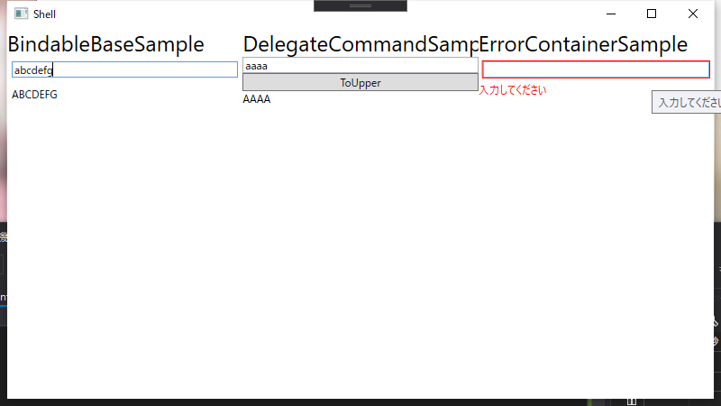

# MVVM の基本クラス

ここでは、Prism で提供されている MVVM の基本クラスについて説明します。

## BindableBase クラス

BindableBase クラスはシンプルな INotifyPropertyChanged の実装クラスです。SetProperty メソッドを使って、シンプルにプロパティを定義出来ます。
例えば、Input というプロパティがあり、それを大文字にしたものを表示する Output というプロパティを持つクラスの定義を BindableBase を使ってやってみましょう。

```cs
using Prism.Mvvm;

namespace MvvmBasicApp.HelloWorld.ViewModels
{
    public class BindableBaseSampleViewModel : BindableBase
    {
        public string HeaderText => "BindableBaseSample";

        private string _input;
        public string Input
        {
            get { return _input; }
            set { SetProperty(ref _input, value, () => RaisePropertyChanged(nameof(Output))); }
        }

        public string Output => Input?.ToUpper();
    }
}
```

BindableBase クラスでは、上記のようにフィールドを定義して、プロパティの set アクセサーの中で SetProperty(ref _fieldName, value, onChanged) という形で値の設定を行います。onChanged は省略可能なので今回のように Input の変更に連動して Output も変更通知したいといったように追加処理がない場合は `SetProperty(ref _fieldName, value)` のように書けます。
これだけで、PropertyChanged イベントの発行やプロパティの値の変更があったときのみの処理などを実現できます。

## DelegateCommand クラス

MVVM で使用する Command の実装クラスも Prism では提供しています。DelegateCommand がそのクラスになります。
DelegateCommand は、コンストラクタの引数に Execute 時に実行される処理と、CanExecute 時に実行される処理を渡します。CanExecute 時の処理は省略可能で、省略した場合は常に実行可能なコマンドになります。

DelegateCommand では CanExecuteChanged の呼び出しを特定のプロパティの変更を監視して行うことが出来ます。
OvserveProperty に式木で監視対象のプロパティを指定しまう。

```cs
command.ObserveProperty(() => Hoge);
```

これで、Hoge プロパティを監視して Hoge プロパティに変更があったら CanExecuteChanged イベントを発行します。このほかに、bool 型のプロパティを受け取り、その値を CanExecute の結果として返しつつプロパティの変更監視をする ObserveCanExecute メソッドも提供されています。

Command を実行したら、Input プロパティの値を大文字にして Output プロパティに変換するコマンド（Input が未入力の場合は実行できない）を持った ViewModelは 以下のようになります。

```cs
using Prism.Commands;
using Prism.Mvvm;

namespace MvvmBasicApp.HelloWorld.ViewModels
{
    public class DelegateCommandSampleViewModel : BindableBase
    {
        public string HeaderText => "DelegateCommandSample";

        private string _input;
        public string Input
        {
            get { return _input; }
            // Input プロパティが変更されたら ToUpperCommandEnabled プロパティも偏向通知をする
            set { SetProperty(ref _input, value, () => RaisePropertyChanged(nameof(ToUpperCommandEnabled))); }
        }

        private string _outpu;
        public string Output
        {
            get { return _outpu; }
            private set { SetProperty(ref _outpu, value); }
        }

        private DelegateCommand _toUpperCommand;
        public DelegateCommand ToUpperCommand =>
            _toUpperCommand ?? (_toUpperCommand = new DelegateCommand(ExecuteToUpperCommand)
                // ToUpperCommandEnabled を CanExecute と紐づける
                .ObservesCanExecute(() => ToUpperCommandEnabled));

        private void ExecuteToUpperCommand()
        {
            Output = Input.ToUpper();
        }

        // Input が空の場合は実行できない
        public bool ToUpperCommandEnabled => !string.IsNullOrWhiteSpace(Input);
    }
}
```

## ErrorsContainer クラス

Prism には、INotifyDataErrorInfo インターフェースの実装を補助する ErrorsContainer クラスがあります。このクラスを使うことで簡単に INotifyDataErrorInfo を使った入力値の検証機能を持ったクラスを作成できます。
ErrorsContainer クラスは、型引数にエラーの型(基本的に string になります)を指定して使います。
コンストラクタには、ErrorsChanged イベントの呼び出し処理を渡します。
そして、ErrorsContainer には HasErrors プロパティと、GetErrors メソッドの処理があるので、これを INotifyDataErrorInfo インターフェースの同名のメソッドで移譲すると INotifyDataErrorInfo の実装が出来ます。

そして、任意のタイミングで SetErrors(propertyName, errorInfo) でエラー情報を設定して、ClearErrors(propertyName) でエラーのクリアをします。以下に INotifyDataErrorInfo を実装したクラスの例を示します。

```cs
using Prism.Mvvm;
using System;
using System.Collections;
using System.Collections.Generic;
using System.ComponentModel;
using System.ComponentModel.DataAnnotations;
using System.Linq;
using System.Runtime.CompilerServices;

namespace MvvmBasicApp.HelloWorld.ViewModels
{
    public class ErrorsContainerSampleViewModel : BindableBase, INotifyDataErrorInfo
    {
        public string HeaderText => "ErrorContainerSample";

        private string _input;

        [Required(ErrorMessage = "入力してください")]
        public string Input
        {
            get { return _input; }
            set { SetProperty(ref _input, value); }
        }

        private ErrorsContainer<string> ErrorsContainer { get; }

        public event EventHandler<DataErrorsChangedEventArgs> ErrorsChanged;

        public ErrorsContainerSampleViewModel()
        {
            ErrorsContainer = new ErrorsContainer<string>(
                x => ErrorsChanged?.Invoke(this, new DataErrorsChangedEventArgs(x)));
        }

        protected override bool SetProperty<T>(ref T storage, T value, [CallerMemberName] string propertyName = null)
        {
            if (!base.SetProperty(ref storage, value, propertyName))
            {
                return false;
            }

            var context = new ValidationContext(this)
            {
                MemberName = propertyName
            };

            var errors = new List<ValidationResult>();
            if (!Validator.TryValidateProperty(value, context, errors))
            {
                this.ErrorsContainer.SetErrors(propertyName, errors.Select(x => x.ErrorMessage));
            }
            else
            {
                this.ErrorsContainer.ClearErrors(propertyName);
            }

            return true;
        }

        public bool HasErrors => ErrorsContainer.HasErrors;

        public IEnumerable GetErrors(string propertyName) => ErrorsContainer.GetErrors(propertyName);
    }
}
```

BindableBase クラスの SetProperty メソッドをオーバーライドして、DataAnnotations を使った入力値の検証をしているクラスになります。Input プロパティが未入力の場合はエラーになります。

## まとめ

ここでは MVVM で開発するときに誰もが書く必要があるコードを省力化するための Prism の機能を紹介しました。
ここで示したコードは、実際に GitHub リポジトリーの 04.MVVMBasic フォルダーにあるアプリで動作確認が出来ます。

実行すると以下のような画面が表示されて、左から BindableBase, DelegateCommand, ErrorsContainer の動作確認をするための ViewModel に紐づいた View が表示されます。

