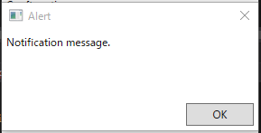
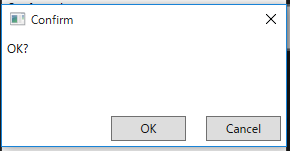
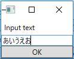

# ユーザーとの対話を実現するInteractionRequest

MVVMパターンでプログラムを組んでいると、よく躓くのがユーザーとの対話機能（ダイアログなど）をどのように実装するかという点です。
割り切ってダイアログを出すコードをViewModelに書いたり、Messengerパターンなどを使うケースがよく行われていると思います。
Prismでは、InteractionRequestというクラスがMessengerパターンを実装しています。

InteractionRequestクラスは型引数を1つとり、INotificationインターフェースを実装したクラスを受け取ることができます。
INotificationインターフェースの実装クラスとしてNotificationクラスとConfirmationクラスがあります。
Notificationクラスが、ユーザーへの通知を行うのに使用するクラスで、ConfirmationクラスがユーザーにYes/Noを問うときに使うクラスになります。

InteractionRequestクラスを使ったユーザーとの対話の処理の流れは以下のようになります。

- InteractionRequestのRaiseメソッド(or RaiseAsyncメソッド)が呼ばれる
- InteractionRequestのRaiseメソッドの引数に渡されたNotificationオブジェクトがViewへ渡る
- ViewではInteractionRequestTriggerビヘイビアを使ってこのメッセージを受け取る
- PopupWindowActionがNotificationメッセージを処理する
	- WindowContentが設定されているなら、それを使ってWindowを出す。
	- Notificationクラスなら、デフォルトのダイアログを出す
	- Confirmationクラスなら、デフォルトの確認ダイアログを出す

## Notificationクラスを使った簡単な通知

まず、一番基本的なNotificationクラスを使ったダイアログを出す処理を説明します。
ViewModelに、Notificationクラスを型引数に指定したInteractionRequestクラスをプロパティとして定義します。

```cs
public InteractionRequest<Notification> NotificationRequest { get; } = new InteractionRequest<Notification>();
```

そして、Commandの処理などのダイアログを出したい個所で以下のようにRaiseメソッドを呼び出します。
NotificationクラスにはTitleプロパティとContentプロパティがあるので値を設定します。
TitleがWindowのタイトルに設定されて、Contentがダイアログのメッセージになります。

```cs
this.NotificationRequest.Raise(new Notification { Title = "Alert", Content = "Notification message." });
```

View側では、以下のようにBehaviorを定義します。

```xml
<prism:InteractionRequestTrigger SourceObject="{Binding NotificationRequest, Mode=OneWay}">
    <prism:PopupWindowAction IsModal="True"
                             CenterOverAssociatedObject="True">
        <prism:PopupWindowAction.WindowStyle>
            <Style TargetType="Window">
                <Setter Property="ResizeMode" Value="NoResize" />
                <Setter Property="SizeToContent" Value="WidthAndHeight" />
            </Style>
        </prism:PopupWindowAction.WindowStyle>
    </prism:PopupWindowAction>
</prism:InteractionRequestTrigger>
```

PopupWindowActionがWindowを表示するActionで、IsModalでモーダル表示の制御、CenterOverAssoiatedObjectで表示位置のカスタマイズが出来ます。
また、WindowStyleプロパティでWindowのStyleを細かく制御出来ます。
ここでは、最大化・最小化ボタンを非表示にしたり、Windowのサイズをコンテンツに合わせた大きさにするように設定しています。

このプログラムを実行すると、以下のようなダイアログが表示されます。



## Confirmationクラスを使ったユーザーとの対話

一方的にViewModelからダイアログで通知をするだけではなくYes/Noなどの選択をユーザーにしてほしいケースがあります。
そんなときには、Confirmationクラスを使用します。
Confirmationクラスは、Notificationクラスを拡張したクラスで、bool型のConfirmedプロパティを持っています。
このクラスを使ってユーザーとの対話をするには以下のように書きます。

まず、Confirmationを指定したInteractionRequestのプロパティを定義します。

```cs
public InteractionRequest<Confirmation> ConfirmationRequest { get; } = new InteractionRequest<Confirmation>();
```

次に、Commandの処理内などのユーザーに確認を取りたいところで、以下のようにRaiseAsyncメソッドを呼び出します。
awaitで、ユーザーが対話を完了するまで待ちます。
RaiseAsyncメソッドの戻り値は、結果が格納されたConfirmationオブジェクトになります。

```cs
private async void ConfirmationCommandExecute()
{
    var result = await this.ConfirmationRequest.RaiseAsync(new Confirmation { Title = "Confirm", Content = "OK?" });
    this.ConfirmationMessage = result.Confirmed + " selected";
}
```

結果を使って続きの処理を記述できます。ここでは、純粋にConfirmationMessageというプロパティに何が選択されたか設定しています。

View側では、以下のようにBehaviorを定義します。

```xml
<prism:InteractionRequestTrigger SourceObject="{Binding ConfirmationRequest, Mode=OneWay}">
    <prism:PopupWindowAction IsModal="True"
                             CenterOverAssociatedObject="True">
        <prism:PopupWindowAction.WindowStyle>
            <Style TargetType="Window">
                <Setter Property="ResizeMode"
                        Value="NoResize" />
                <Setter Property="SizeToContent"
                        Value="WidthAndHeight" />
            </Style>
        </prism:PopupWindowAction.WindowStyle>
    </prism:PopupWindowAction>
</prism:InteractionRequestTrigger>
```

基本的にNotificationのときと同じです。
このプログラムを実行すると以下のようなダイアログが表示されます。



OKボタンを押すと”True selected"とプロパティに値が設定され、Cancelボタンを押すと”False selected"とプロパティに値が設定されます。

## カスタムWindowの表示

Notificationオブジェクトを拡張して、PopupWindowActionのWindowContentプロパティと組みあわせることで、独自のダイアログを出すことが出来ます。
例として、文字列を入力するInputTextダイアログを作成してみます。

Notificationクラスを拡張して、入力した文字列を格納するためのInputTextプロパティを持ったクラスを定義します。

```cs
using Prism.Interactivity.InteractionRequest;

namespace InteractionRequestSampleModule.Models
{
    class InputNotification : Notification
    {
        public string InputText { get; set; }
    }
}
```

次に、このクラスを表示するための画面のViewModelを作成します。このViewModelクラスにはIInteractionRequestAwareインターフェースを実装します。
このインターフェースは、FinishInteractionというWindowを閉じてユーザーとの対話を終わらせるための処理を受け付けるAction型のプロパティと
Notificationという、RaiseAsyncメソッドに渡されたNotificationオブジェクトを受け取るためのINotification型のプロパティが定義されています。

これらのプロパティを使ってOKCommandが実行されたときにInputNotificationに入力テキストを反映する処理を書くと以下のようになります。

```cs
using InteractionRequestSampleModule.Models;
using Prism.Commands;
using Prism.Interactivity.InteractionRequest;
using Prism.Mvvm;
using System;

namespace InteractionRequestSampleModule.ViewModels
{
    class InputViewModel : BindableBase, IInteractionRequestAware
    {
        // IInteractionRequestAware
        public Action FinishInteraction { get; set; }
        private INotification notification;
        public INotification Notification
        {
            get { return this.notification; }
            set
            {
                this.notification = value;
                // initialize
                this.InputText = "";
            }
        }

        private string inputText;

        public string InputText
        {
            get { return this.inputText; }
            set { this.SetProperty(ref this.inputText, value); }
        }

        public DelegateCommand OKCommand { get; }

        public InputViewModel()
        {
            this.OKCommand = new DelegateCommand(() =>
                {
                    ((InputNotification)this.Notification).InputText = this.InputText;
                    this.FinishInteraction();
                },
                () => !string.IsNullOrWhiteSpace(this.InputText))
                .ObservesProperty(() => this.InputText);
        }
    }
}
```

このInputViewModelの注意点としては、ダイアログの表示時にインスタンスが使いまわされるため、Notificationがsetされたタイミングで初期化を行う必要がある点です。
ここでは、InputTextプロパティを空に初期化しています。

次に、Viewを定義します。これは単純にTextBoxとButtonを持った画面になります。

```xml
<UserControl x:Class="InteractionRequestSampleModule.Views.InputView"
             xmlns="http://schemas.microsoft.com/winfx/2006/xaml/presentation"
             xmlns:x="http://schemas.microsoft.com/winfx/2006/xaml"
             xmlns:mc="http://schemas.openxmlformats.org/markup-compatibility/2006"
             xmlns:d="http://schemas.microsoft.com/expression/blend/2008"
             xmlns:local="clr-namespace:InteractionRequestSampleModule.Views"
             xmlns:prism="http://prismlibrary.com/"
             mc:Ignorable="d"
             prism:ViewModelLocator.AutoWireViewModel="True"
             d:DesignHeight="300"
             d:DesignWidth="300">
    <StackPanel>
        <Label x:Name="label"
               Content="Input text" />
        <TextBox x:Name="textBox"
                 Text="{Binding InputText, Mode=TwoWay, UpdateSourceTrigger=PropertyChanged}" />
        <Button x:Name="button"
                Content="OK" 
                Command="{Binding OKCommand}"/>
    </StackPanel>
</UserControl>
```

この画面を表示するには以下のようにします。

まず、InputNotificationを型引数に指定したInteractionRequest型のプロパティを定義します。

```cs
public InteractionRequest<InputNotification> InputNotificationRequest { get; } = new InteractionRequest<InputNotification>();
```

次に、Commandなどの画面を表示したい処理のところでRaiseAsyncをInputNotificationを渡して呼び出します。

```cs
private async void InputNotificationExecute()
{
    var result = await this.InputNotificationRequest.RaiseAsync(new InputNotification { Title = "Input" });
    this.OutputText = $"Input text is {result.InputText}.";
}
```

Confirmationと同じようにawaitでユーザーとの対話の終わりを待ちます。ユーザーとの対話が終わったら、ここでは入力されたテキストを加工して
OutputTextプロパティに設定しています。

View側のBehaviorの定義は以下のようになります。

```xml
<prism:InteractionRequestTrigger SourceObject="{Binding InputNotificationRequest, Mode=OneWay}">
    <prism:PopupWindowAction>
        <prism:PopupWindowAction.WindowContent>
            <local:InputView />
        </prism:PopupWindowAction.WindowContent>
    </prism:PopupWindowAction>
</prism:InteractionRequestTrigger>
```

WindowContentに先ほど作成したInputViewを指定している点がポイントです。こうすることで表示されるWindowの内容を変えることができます。
実行すると以下のように画面が表示されます。



