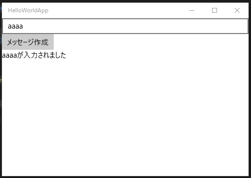

# Hello world

UWP版のPrism.WndowsのHello worldを作成します。Hello worldの作成を通じて基本的なPrism.Windowsを使ったアプリケーションの作成方法を解説します。
Prism.Windowsには、素の状態のPrism.WindowsとDIコンテナであるUnity(とAutoFac)を前提としたバージョンがあります。
ここでは、Unityを前提としたPrism.Unityを使って解説します。

## Prism.Unityを使う理由

素のPrism.WindowsではなくてDIコンテナを使う理由は以下の通りです。

- クラスのインスタンス管理を手動でしたくないため
- クラス間の依存関係の注入を手動でしたくないため

これに尽きます。例えば、MainPageViewModelで、Prismの画面遷移機能であるINavigationServiceを使うときDIコンテナを使わない場合は以下の2ステップを踏みます。

- コンストラクタにINavigationServiceを受け取るようにMainPageViewModelを作る
- AppクラスでMainPageViewModelの生成ロジックを追加してINavigationServiceを渡すようにする

DIコンテナを使うと以下の手順になります。

- コンストラクタにINavigationServiceを受け取るようにMainPageViewModelを作る

以上です。

ちょっとした差ですが、依存するサービスが増えてきたり、ページ数が増えてくると負担が線形的に増えてしまいます。そのため、ここではPrism.Unityを前提にHello worldを作成します。

## プロジェクトの作成と参照の設定

HelloWorldAppという名前でUWPのプロジェクトを作ります。そして、NuGetからPrism.Unityを追加します。

## Appクラスの書き換え

次にAppクラスを書き換えます。PrismUnityApplicationクラスを継承するようにAppクラスを変更します。
そして、OnLauncheApplicationAsyncをオーバーライドして画面遷移のためのサービスであるNavigationServiceを使ってMainページへ遷移するように処理を記述します。

```cs
using Prism.Unity.Windows;
using System.Threading.Tasks;
using Windows.ApplicationModel.Activation;

namespace HelloWorldApp
{
    /// <summary>
    /// 既定の Application クラスを補完するアプリケーション固有の動作を提供します。
    /// </summary>
    sealed partial class App : PrismUnityApplication
    {
        /// <summary>
        /// 単一アプリケーション オブジェクトを初期化します。これは、実行される作成したコードの
        ///最初の行であるため、main() または WinMain() と論理的に等価です。
        /// </summary>
        public App()
        {
            this.InitializeComponent();
        }

        protected override Task OnLaunchApplicationAsync(LaunchActivatedEventArgs args)
        {
            this.NavigationService.Navigate("Main", null);
            return Task.CompletedTask;
        }

    }
}
```

基本クラスの変更に伴いApp.xamlのタグも書き換えます。

```xml
<prism:PrismUnityApplication x:Class="HelloWorldApp.App"
                             xmlns="http://schemas.microsoft.com/winfx/2006/xaml/presentation"
                             xmlns:x="http://schemas.microsoft.com/winfx/2006/xaml"
                             xmlns:local="using:HelloWorldApp"
                             xmlns:prism="using:Prism.Unity.Windows"
                             RequestedTheme="Light">

</prism:PrismUnityApplication>
```

## Mainページの作成

Prismでは、デフォルトでViews/xxxxPageという名前(xxxxがNavigationServiceに渡した文字列)の画面に遷移します。今回の場合"Main"を渡しているのでMainPageになります。
デフォルトで作成されているMainPage.xamlを削除します。
そして、Views名前空間を作成してMainPage.xamlを作成します。

## ViewModelの作成

MainPageに紐づくViewModelを作成します。
PrismではデフォルトでViews/xxxxPageに対してViewModels/xxxxPageViewModelという名前のViewModelを割り当てる機能があります。
この命名規約に沿うために、ViewModels名前空間を作成して、MainPageViewModelというクラスを作成します。

今回はHello worldなので簡単な入力を受け取ってメッセージを加工して出力するViewModelにしました。

```cs
using Prism.Commands;
using Prism.Windows.Mvvm;

namespace HelloWorldApp.ViewModels
{
    class MainPageViewModel : ViewModelBase
    {
        private string input;

        public string Input
        {
            get { return this.input; }
            set { this.SetProperty(ref this.input, value); }
        }

        private string output;

        public string Output
        {
            get { return this.output; }
            set { this.SetProperty(ref this.output, value); }
        }

        public DelegateCommand CreateOutputCommand { get; }

        public MainPageViewModel()
        {
            this.CreateOutputCommand = new DelegateCommand(() =>
                {
                    this.Output = $"{Input}が入力されました";
                },
                () => !string.IsNullOrWhiteSpace(this.Input))
                .ObservesProperty(() => this.Input);
        }
    }
}
```

特徴的なのは、DelegateCOmmandがInputに何か入力されてないと実行できない点です。また、Prism 6から追加されたObservePropertyメソッドを使ってInputプロパティに変更がある度に実行可否を判断するようにしています。

## ViewとViewModelの紐づけ

ViewとViewModelを紐づけるにはViewModelLocatorクラスを使います。
ViewModelLocatorのAutoWiredViewModel添付プロパティをTrueに設定することで機能が有効化されます。

```cs
<Page x:Class="HelloWorldApp.Views.MainPage"
      xmlns="http://schemas.microsoft.com/winfx/2006/xaml/presentation"
      xmlns:x="http://schemas.microsoft.com/winfx/2006/xaml"
      xmlns:local="using:HelloWorldApp.Views"
      xmlns:d="http://schemas.microsoft.com/expression/blend/2008"
      xmlns:mc="http://schemas.openxmlformats.org/markup-compatibility/2006"
      xmlns:mvvm="using:Prism.Windows.Mvvm"
      mvvm:ViewModelLocator.AutoWireViewModel="True"
      mc:Ignorable="d">

    <Grid Background="{ThemeResource ApplicationPageBackgroundThemeBrush}">

    </Grid>
</Page>
```

これでDataContextに自動的にMainPageViewModelが設定されます。
コンパイル時データバインディングを使うためにMainPageのコードビハインドにプロパティを定義します。

```cs
using HelloWorldApp.ViewModels;
using Windows.UI.Xaml.Controls;

namespace HelloWorldApp.Views
{
    /// <summary>
    /// それ自体で使用できる空白ページまたはフレーム内に移動できる空白ページ。
    /// </summary>
    public sealed partial class MainPage : Page
    {
        private MainPageViewModel ViewModel => this.DataContext as MainPageViewModel;

        public MainPage()
        {
            this.InitializeComponent();
        }
    }
}
```

InputとOutputとCreateOutputCommandをバインドする画面を作ります。

```xml
<Page x:Class="HelloWorldApp.Views.MainPage"
      xmlns="http://schemas.microsoft.com/winfx/2006/xaml/presentation"
      xmlns:x="http://schemas.microsoft.com/winfx/2006/xaml"
      xmlns:local="using:HelloWorldApp.Views"
      xmlns:d="http://schemas.microsoft.com/expression/blend/2008"
      xmlns:mc="http://schemas.openxmlformats.org/markup-compatibility/2006"
      xmlns:mvvm="using:Prism.Windows.Mvvm"
      mvvm:ViewModelLocator.AutoWireViewModel="True"
      mc:Ignorable="d">

    <StackPanel Background="{ThemeResource ApplicationPageBackgroundThemeBrush}">
        <TextBox Text="{x:Bind ViewModel.Input, Mode=TwoWay}" />
        <Button Content="メッセージ作成"
                Command="{x:Bind ViewModel.CreateOutputCommand}" />
        <TextBlock Text="{x:Bind ViewModel.Output, Mode=OneWay}"
                   Style="{StaticResource BodyTextBlockStyle}" />
    </StackPanel>
</Page>
```

## 実行して動作確認

実行すると以下のようになります。TextBoxに何かを入れてボタンを押すと下側にメッセージが出力されます。


