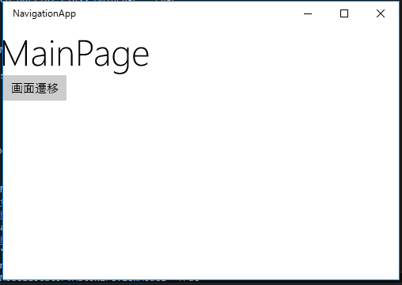
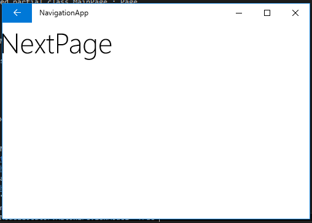

# 画面遷移

Prismの画面遷移は、ViewModelクラスでINavigationServiceインターフェースを使用して行います。
INavigationServiceは、PrismUnityApplicationに定義されているため、ViewModelクラスにはDIして使う必要があります。
ここでは、ボタンを押したら画面遷移する簡単なアプリケーションを作成したいと思います。

## プロジェクトの作成

NavigationAppという名前でUWPアプリを作りPrism.UnityをNuGetから参照に追加します。
Appクラスを以下のように編集して初期状態でMainPageに画面遷移するようにします。

```cs
using Prism.Unity.Windows;
using System.Threading.Tasks;
using Windows.ApplicationModel.Activation;

namespace NavigationApp
{
    /// <summary>
    /// 既定の Application クラスを補完するアプリケーション固有の動作を提供します。
    /// </summary>
    sealed partial class App : PrismUnityApplication
    {
        /// <summary>
        /// 単一アプリケーション オブジェクトを初期化します。これは、実行される作成したコードの
        ///最初の行であるため、main() または WinMain() と論理的に等価です。
        /// </summary>
        public App()
        {
            this.InitializeComponent();
        }

        protected override Task OnLaunchApplicationAsync(LaunchActivatedEventArgs args)
        {
            this.NavigationService.Navigate("Main", null);
            return Task.CompletedTask;
        }
    }
}
```

App.xaml側も基本クラスがPrismUnityApplicationになるようにタグを書き換えます。

```xml
<prism:PrismUnityApplication x:Class="NavigationApp.App"
                             xmlns="http://schemas.microsoft.com/winfx/2006/xaml/presentation"
                             xmlns:x="http://schemas.microsoft.com/winfx/2006/xaml"
                             xmlns:local="using:NavigationApp"
                             xmlns:prism="using:Prism.Unity.Windows"
                             RequestedTheme="Light">

</prism:PrismUnityApplication>
```

## MainPageの作成

Views/MainPage.xamlを作成します。
画面にはMainPageということがわかるためのTextBlockと画面遷移の契機となるButtonを置いてます。

```xml
<Page x:Class="NavigationApp.Views.MainPage"
      xmlns="http://schemas.microsoft.com/winfx/2006/xaml/presentation"
      xmlns:x="http://schemas.microsoft.com/winfx/2006/xaml"
      xmlns:local="using:NavigationApp.Views"
      xmlns:d="http://schemas.microsoft.com/expression/blend/2008"
      xmlns:mc="http://schemas.openxmlformats.org/markup-compatibility/2006"
      xmlns:mvvm="using:Prism.Windows.Mvvm"
      mvvm:ViewModelLocator.AutoWireViewModel="True"
      mc:Ignorable="d">

    <StackPanel Background="{ThemeResource ApplicationPageBackgroundThemeBrush}">
        <TextBlock Text="MainPage"
                   Style="{StaticResource HeaderTextBlockStyle}" />
        <Button Content="画面遷移" />
    </StackPanel>
</Page>
```

AutoWIredViewModelの定義も忘れずに追加します。次にViewModels/MainPageViewModelを作成します。

PrismではViewModelはViewModelBaseクラスを継承して作成します。
ViewModelBaseクラスには、画面遷移してきたときに呼ばれるOnNavigatedToメソッドと画面から離れるときに呼ばれるOnNavigationgFromメソッドが定義されています。
それぞれのメソッドをオーバーライドすることで、画面遷移時の処理をViewModelで記述できます。
Prismを使わない場合は、View側でしか出来なかった処理になります。

画面遷移処理は、INavigationServiceを使って行います。
Unityを使ったPrismでは、ViewModelのコンストラクタにINavigationServiceを受け取るようにするとViewModelのインスタンス化のタイミングで自動的にINavigationServiceが渡されます。
そのインスタンスを、フィールドなりプロパティに保持しておいて画面遷移に使います。

ここでは、NavigateNextPageメソッドで使用しています。

```cs
using Prism.Windows.Mvvm;
using Prism.Windows.Navigation;
using System.Collections.Generic;
using System.Diagnostics;

namespace NavigationApp.ViewModels
{
    class MainPageViewModel : ViewModelBase
    {
        private INavigationService NavigationService { get; }

        // コンストラクタを定義することでUnityからインスタンスが自動で渡される
        public MainPageViewModel(INavigationService navigationService)
        {
            // Unityから渡されたインスタンスを保持
            this.NavigationService = navigationService;
        }

        // INavigationServiceを使って画面遷移を行う
        public void NavigateNextPage()
        {
            this.NavigationService.Navigate("Next", null);
        }

        public override void OnNavigatedTo(NavigatedToEventArgs e, Dictionary<string, object> viewModelState)
        {
            base.OnNavigatedTo(e, viewModelState);
            Debug.WriteLine("MainPageに来ました");
        }

        public override void OnNavigatingFrom(NavigatingFromEventArgs e, Dictionary<string, object> viewModelState, bool suspending)
        {
            base.OnNavigatingFrom(e, viewModelState, suspending);
            Debug.WriteLine("MainPageから離れます");
        }
    }
}
```

MainPageのXAMLからNavigateNextPageを呼び出すようにします。
まず、コンパイル時データバインディングのためのプロパティをMainPage.xaml.csに定義します。
DataContextをキャストして返しているだけになります。

```cs
using NavigationApp.ViewModels;
using Windows.UI.Xaml.Controls;

namespace NavigationApp.Views
{
    public sealed partial class MainPage : Page
    {
        private MainPageViewModel ViewModel => this.DataContext as MainPageViewModel;

        public MainPage()
        {
            this.InitializeComponent();
        }
    }
}
```

そして、ButtonのClickイベントにNavigateNextPageメソッドをバインドします。

```xml
<Page x:Class="NavigationApp.Views.MainPage"
      xmlns="http://schemas.microsoft.com/winfx/2006/xaml/presentation"
      xmlns:x="http://schemas.microsoft.com/winfx/2006/xaml"
      xmlns:local="using:NavigationApp.Views"
      xmlns:d="http://schemas.microsoft.com/expression/blend/2008"
      xmlns:mc="http://schemas.openxmlformats.org/markup-compatibility/2006"
      xmlns:mvvm="using:Prism.Windows.Mvvm"
      mvvm:ViewModelLocator.AutoWireViewModel="True"
      mc:Ignorable="d">

    <StackPanel Background="{ThemeResource ApplicationPageBackgroundThemeBrush}">
        <TextBlock Text="MainPage"
                   Style="{StaticResource HeaderTextBlockStyle}" />
        <Button Content="画面遷移" 
                Click="{x:Bind ViewModel.NavigateNextPage}"/>
    </StackPanel>
</Page>
```

## NextPageの作成

次に繊維先のNextPageを作成します。シンプルにTextBlockを置いただけの画面です。

```xml
<Page x:Class="NavigationApp.Views.NextPage"
      xmlns="http://schemas.microsoft.com/winfx/2006/xaml/presentation"
      xmlns:x="http://schemas.microsoft.com/winfx/2006/xaml"
      xmlns:local="using:NavigationApp.Views"
      xmlns:d="http://schemas.microsoft.com/expression/blend/2008"
      xmlns:mc="http://schemas.openxmlformats.org/markup-compatibility/2006"
      mc:Ignorable="d">

    <Grid Background="{ThemeResource ApplicationPageBackgroundThemeBrush}">
        <TextBlock Text="NextPage"
                   Style="{StaticResource HeaderTextBlockStyle}" />
    </Grid>
</Page>
```


## 実行して動作確認

実行すると、MainPageが表示され、ボタンを押すとNextPageが表示されます。
このときデバッグ出力に以下のようなメッセージが表示されることも確認できます。（MainPageViewModelで仕込んだログ）


```
MainPageに来ました
MainPageから離れます
```




