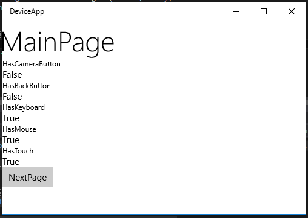
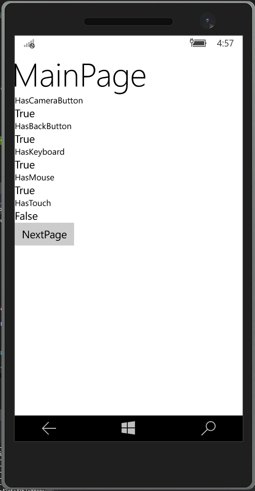

# 戻るボタン・ハードウェアボタン対応

UWP版Prismには、戻るボタンへの対応やデスクトップでのタイトルバーの戻るボタンの表示・非表示対応や、電話のハードウェアの戻るボタンカメラボタンへの対応サポート機能があります。
順番に見ていこうと思います。

## DeviceGestureService
デバイス関連のサービスにアクセスするには、PrismUnityApplicationクラスで定義されているDeviceGestureServiceプロパティからIDeviceGestureServiceインターフェースを取得して使います。
ViewModelで、このDeviceGestureServiceを使うには、INavigationServiceと同様にViewModelのコンストラクタでIDeviceGestureServiceを受け取るようにします。

IDeviceGestureServiceには、各種ハードウェアの有無を問い合わせるための以下のプロパティが定義されています。

- IsHardwareCameraButtonPresent
- IsHardwareBackButtonPresent
- IsKeyboardPresent
- IsMousePresent
- IsTouchPresent

名前の通り上から順番に、カメラボタン、戻るボタン、キーボード、マウス、タッチが提供されているか確認できます。

さらに、ハードウェアボタンとマウスに関しては各イベントが提供されています。

- GoBackRequested
- CameraButtonPressed
- CameraButtonHalfPressed
- CameraButtonReleased
- MouseMoved

順番に戻る処理、カメラボタンが押されたか、半押しされたか、離されたか、マウスが動いたかといったイベントが取れます。

## ViewModelでの使用

ViewModelでDeviceGestureServiceを使う例を以下に示します。

```cs
using Prism.Windows.AppModel;
using Prism.Windows.Mvvm;
using Prism.Windows.Navigation;
using System.Collections.Generic;
using System.Diagnostics;

namespace DeviceApp.ViewModels
{
    class MainPageViewModel : ViewModelBase
    {
        private INavigationService NavigationService { get; }

        private IDeviceGestureService DeviceGestureService { get; }

        public bool HasCameraButton => this.DeviceGestureService.IsHardwareCameraButtonPresent;

        public bool HasBackButton => this.DeviceGestureService.IsHardwareBackButtonPresent;

        public bool HasKeyboard => this.DeviceGestureService.IsKeyboardPresent;

        public bool HasMouse => this.DeviceGestureService.IsMousePresent;

        public bool HasTouch => this.DeviceGestureService.IsTouchPresent;

        public MainPageViewModel(INavigationService ns, IDeviceGestureService ds)
        {
            this.NavigationService = ns;
            this.DeviceGestureService = ds;
        }

        public override void OnNavigatedTo(NavigatedToEventArgs e, Dictionary<string, object> viewModelState)
        {
            base.OnNavigatedTo(e, viewModelState);
            this.DeviceGestureService.GoBackRequested += this.DeviceGestureService_GoBackRequested;
            this.DeviceGestureService.CameraButtonPressed += this.DeviceGestureService_CameraButtonPressed;
            this.DeviceGestureService.MouseMoved += this.DeviceGestureService_MouseMoved;
        }

        private void DeviceGestureService_MouseMoved(object sender, Windows.Devices.Input.MouseEventArgs e)
        {
            Debug.WriteLine($"{e.MouseDelta.X}, {e.MouseDelta.Y}");
        }

        public void NavigateNextPage()
        {
            this.NavigationService.Navigate("Next", null);
        }

        private void DeviceGestureService_CameraButtonPressed(object sender, DeviceGestureEventArgs e)
        {
            Debug.WriteLine(nameof(this.DeviceGestureService_CameraButtonPressed));
        }

        private void DeviceGestureService_GoBackRequested(object sender, DeviceGestureEventArgs e)
        {
            Debug.WriteLine(nameof(this.DeviceGestureService_GoBackRequested));
            e.Handled = true;
            e.Cancel = true;
        }

        public override void OnNavigatingFrom(NavigatingFromEventArgs e, Dictionary<string, object> viewModelState, bool suspending)
        {
            base.OnNavigatingFrom(e, viewModelState, suspending);
            this.DeviceGestureService.GoBackRequested -= this.DeviceGestureService_GoBackRequested;
            this.DeviceGestureService.CameraButtonPressed -= this.DeviceGestureService_CameraButtonPressed;
            this.DeviceGestureService.MouseMoved -= this.DeviceGestureService_MouseMoved;
        }
    }
}
```

各種プロパティをViewModelのプロパティとして公開しているのと、戻るボタン、カメラボタン、マウスが動いたときのイベントをハンドリングしています。
戻るボタンのイベントは、HandledとCancelをTrueに設定することで、処理をキャンセルすることができます。MainPageでこれをやると戻るボタンで終了できないアプリなども実現できます。
（やったらいけないだろうけど）

このViewModelのプロパティをバインドした画面は以下のようになります。





Mobileがエミュレータなせいか、TouchがFalseでMouseがTrueになってるのが気になります。実機がないので実機での動作が試せないですが解せぬ動きですね。

また、戻るボタンやカメラボタンを押すとデバッグ出力に以下のようなメッセージが表示されます。

```
DeviceGestureService_GoBackRequested
DeviceGestureService_CameraButtonPressed
```

## デスクトップのタイトルバーの戻るボタンの非表示

Prismではデフォルトでデスクトップの戻るボタンが表示されます。
これを非表示にするには、DeviceGestureServiceの作成処理を以下のようにオーバーライドする必要があります。

```cs
// App.xaml.cs
protected override IDeviceGestureService OnCreateDeviceGestureService() => 
    new DeviceGestureService { UseTitleBarBackButton = false };
```

UseTitleBarBackButtonにfalseを設定している点がポイントです。


