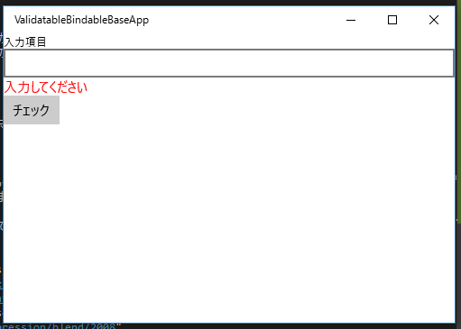

# MVVMの基本クラス

PrismにはMVVMを支援するクラスがいくつか定義されています。

- BindableBase
- DelegateCommand
- ViewModelBase
- ValidatableBindableBase

BindableBase及び、DelegateCommandについてはWPF版と共通なためそちらを参照してください。

[MVVMの基本クラス](../../04.MVVMBasic/README.md)

ViewModelBaseについては、画面遷移用のコールバック機能と一時保存に対応したBindableBaseの派生クラスです。
画面遷移については、[画面遷移](../03.Navigation/README.md)を参照してください。
一時保存については別記事で解説します。

## ValidatableBindableBase

Prismには、DataAnnotationsによる入力値の検証をサポートするクラスを作成するためのValidatableBindableBaseというクラスがあります。
このクラスを使うと簡単に入力値の検証機能を作ることができます。

作成方法は、ValidatableBindableBaseクラスを継承して、SetPropertyを呼ぶ形でプロパティを定義するだけです。
あとは、検証したいプロパティにDataAnnotationsをつけることで機能が有効かされます。

Inputというプロパティが必須入力のクラスの定義霊を以下に示します。

```cs
using Prism.Windows.Validation;
using System.ComponentModel.DataAnnotations;

namespace ValidatableBindableBaseApp.ViewModels
{
    class InputDataViewModel : ValidatableBindableBase
    {
        private string input;

        [Required(ErrorMessage = "入力してください")]
        public string Input
        {
            get { return this.input; }
            set { this.SetProperty(ref this.input, value); }
        }

    }
}
```

デフォルトでは、プロパティに値が設定されたタイミングで値の検証が走ります。
そのほかに任意のプロパティの値の検証や、全てのプロパティの値の検証を行うメソッドが提供されています。

- ValidateProperty
- ValidateProperties

メソッドの戻り値はbool型で、falseが返るとエラーがあることを示しています。

### エラーの結果の取得

ValidatableBindableBaseのErrorsプロパティで取得できるクラスにはインデクサが定義されていて、そこにプロパティ名を渡すことでエラーメッセージのコレクションが取得できます。
これを画面でBindingすることで、エラーメッセージの表示ができます。

ViewModelにInputという名前で先ほどのクラスを定義した画面でエラーメッセージの表示を実現する方法を以下に示します。

```xml
<Page x:Class="ValidatableBindableBaseApp.Views.MainPage"
      xmlns="http://schemas.microsoft.com/winfx/2006/xaml/presentation"
      xmlns:x="http://schemas.microsoft.com/winfx/2006/xaml"
      xmlns:local="using:ValidatableBindableBaseApp.Views"
      xmlns:d="http://schemas.microsoft.com/expression/blend/2008"
      xmlns:mc="http://schemas.openxmlformats.org/markup-compatibility/2006"
      xmlns:mvvm="using:Prism.Windows.Mvvm"
      mvvm:ViewModelLocator.AutoWireViewModel="True"
      mc:Ignorable="d">

    <StackPanel Background="{ThemeResource ApplicationPageBackgroundThemeBrush}">
        <TextBlock Text="入力項目"
                   Style="{StaticResource CaptionTextBlockStyle}" />
        <TextBox Text="{x:Bind ViewModel.InputData.Input, Mode=TwoWay}" />
        <ItemsControl ItemsSource="{Binding InputData.Errors[Input], Mode=OneWay}"
                      Foreground="Red" />
        <Button Content="チェック"
                Click="{x:Bind ViewModel.Alert}" />
    </StackPanel>
</Page>
```

表示結果は以下のようになります。



エラーの有無の判定は、GetAllErrorsメソッドに要素が含まれてるかどうかで判定できます。
コード零を以下に示します。

```cs
public async void Alert()
{
    if (this.InputData.GetAllErrors().Any())
    {
        var dlg = new MessageDialog("HasError");
        await dlg.ShowAsync();
    }
    else
    {
        var dlg = new MessageDialog("NoError");
        await dlg.ShowAsync();
    }
}
```
